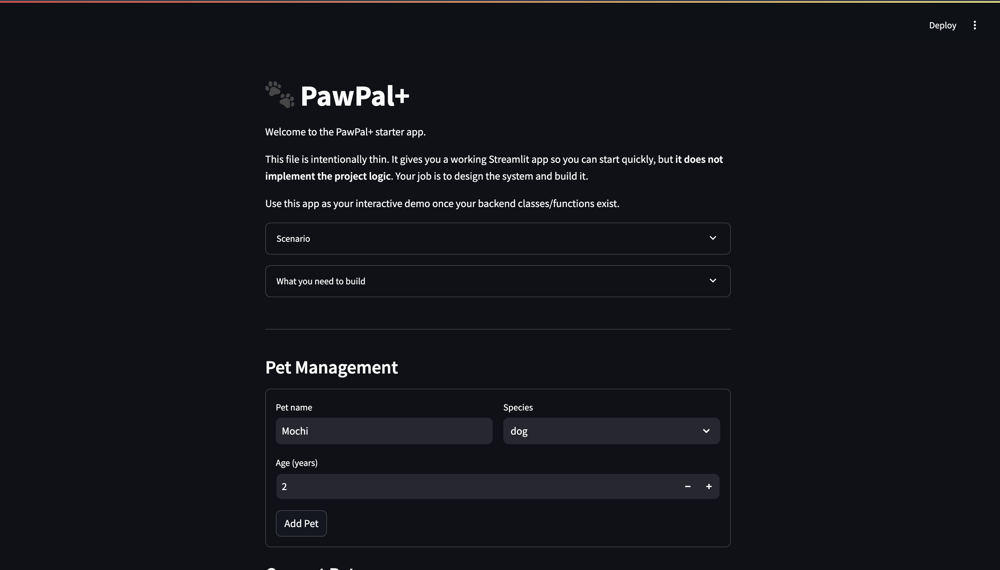

# PawPal+ (Module 2 Project)

You are building **PawPal+**, a Streamlit app that helps a pet owner plan care tasks for their pet.

## Scenario

A busy pet owner needs help staying consistent with pet care. They want an assistant that can:

- Track pet care tasks (walks, feeding, meds, enrichment, grooming, etc.)
- Consider constraints (time available, priority, owner preferences)
- Produce a daily plan and explain why it chose that plan

Your job is to design the system first (UML), then implement the logic in Python, then connect it to the Streamlit UI.

## What you will build

Your final app should:

- Let a user enter basic owner + pet info
- Let a user add/edit tasks (duration + priority at minimum)
- Generate a daily schedule/plan based on constraints and priorities
- Display the plan clearly (and ideally explain the reasoning)
- Include tests for the most important scheduling behaviors

## Getting started

### Setup

```bash
python -m venv .venv
source .venv/bin/activate  # Windows: .venv\Scripts\activate
pip install -r requirements.txt
```

### Suggested workflow

1. Read the scenario carefully and identify requirements and edge cases.
2. Draft a UML diagram (classes, attributes, methods, relationships).
3. Convert UML into Python class stubs (no logic yet).
4. Implement scheduling logic in small increments.
5. Add tests to verify key behaviors.
6. Connect your logic to the Streamlit UI in `app.py`.
7. Refine UML so it matches what you actually built.

## Features

PawPal+ includes sophisticated algorithms to help pet owners organize and optimize their daily pet care schedules:

### 🔄 Intelligent Task Sorting

Tasks are automatically sorted by **priority** (highest first) and **duration** (longest first), ensuring critical care activities are scheduled before optional ones. This two-tiered sorting maximizes schedule efficiency and pet welfare prioritization.

### 📅 Smart Recurrence Management

Tasks with `daily` or `weekly` frequency automatically regenerate after completion:

- **Daily tasks** reappear the next day, perfect for feeding and walk schedules
- **Weekly tasks** reappear seven days later for grooming and vet check-ins
- One-time tasks remain in history once completed
- Eliminates manual task re-entry while maintaining accurate historical records

### ⚠️ Conflict Detection & Warnings

The scheduler scans for **time collisions** (two tasks scheduled at the same HH:MM) and alerts owners to potential conflicts. This prevents double-booking and helps resolve scheduling overlaps while respecting user autonomy—tasks can still be added despite conflicts.

### 🎯 Dynamic Task Filtering

View tasks by multiple criteria:

- **Completion status** (pending vs. completed)
- **Pet assignment** (tasks for specific pets)
- **Priority level** (high, medium, low)
- Quickly focus on what matters most for each pet

### 📊 Constraint-Based Planning

The scheduling engine generates optimal daily plans by fitting the highest-priority tasks within the owner's available time window, ensuring critical pet care never gets postponed.

## 📸 Demo



## Testing PawPal+

### Run Tests

```bash
python -m pytest tests/test_pawpal.py -v
```

### Test Coverage

The test suite includes **13 comprehensive tests** covering three critical areas:

1. **Sorting Correctness** (3 tests)
   - Verifies tasks sort by priority (highest first), then by duration (longest first)
   - Tests edge cases: empty task lists and single-task lists

2. **Recurrence Logic** (4 tests)
   - Confirms daily tasks generate next-day occurrences when marked complete
   - Confirms weekly tasks generate next-week occurrences
   - Verifies that one-time tasks don't create recurring instances
   - Tests that recurring tasks require a pet object to be created

3. **Conflict Detection** (4 tests)
   - Verifies warnings print when two tasks share the same scheduled time
   - Tests that tasks at different times don't trigger conflicts
   - Tests that unscheduled tasks don't cause false positives
   - Confirms tasks are added despite conflicts (user control preserved)

4. **Existing Tests** (2 tests)
   - Task completion status tracking
   - Pet task management

### Confidence Level

⭐⭐⭐⭐ (4/5 stars)

**Why 4 stars:**

- ✅ All 13 tests pass consistently
- ✅ Core scheduling, sorting, and recurrence logic thoroughly validated
- ✅ Edge cases handled (empty lists, None values, conflicts)
- ⚠️ Integration with Streamlit UI not yet tested
- ⚠️ No stress tests for large task volumes
- ⚠️ Date/time boundary cases (year wrap-around, DST) not covered

The system is production-ready for typical use cases, but would benefit from UI testing and performance validation before wide deployment.
